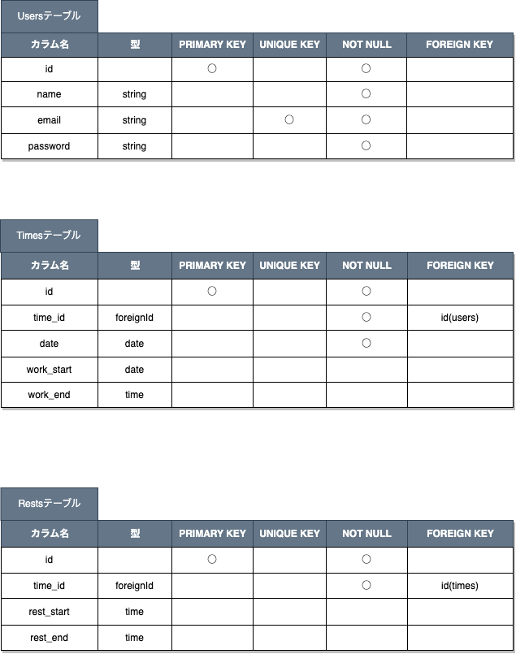
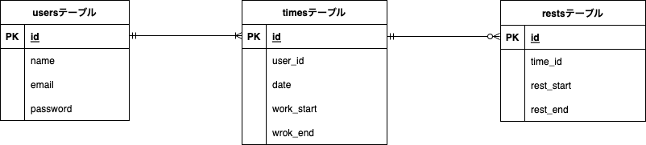

# Atte(勤怠管理システム)

- 打刻ページ（メインページ）


ある企業の社内用勤怠管理システム Atte です。  
各打刻ボタンを押すと、打刻した時刻情報がデータベースに保存され、日付別勤怠ページに反映されます。

- 日付別勤怠ページ


日付別勤怠ページでは、打刻ボタンを押した時刻（勤務開始・終了）と、勤務時間・休憩時間が日付別に表示されます。  
すでに認証されたユーザーの日付別情報を閲覧することが出来ます。

## 作成した目的

社内での人事評価があり、各社員の勤怠情報管理が必要になった為。

## アプリケーション URL

- 開発環境：http://localhost/
- phpMyAdmin:：http://localhost:8080/

## 機能一覧

- 会員登録機能
- ログイン機能
- ログアウト機能

## 使用技術（実行環境）

- PHP8.3.0
- Laravel8.83.27
- MySQL8.0.26
- Breeze1.10

## テーブル設計



## ER 図



## 環境構築

**Docker ビルド**

1. `git clone git@github.com:kngshi/atte.git`
2. DockerDesktop アプリを立ち上げる
3. `docker-compose up -d --build`

> _Mac の M1・M2 チップの PC の場合、`no matching manifest for linux/arm64/v8 in the manifest list entries`のメッセージが表示されビルドができないことがあります。
> エラーが発生する場合は、docker-compose.yml ファイルの「mysql」内に「platform」の項目を追加で記載してください_

```bash
mysql:
    platform: linux/x86_64(この文を追加)
    image: mysql:8.0.26
    environment:
```

**Laravel 環境構築**

1. `docker-compose exec php bash`
2. `composer install`
3. 「.env.example」ファイルを 「.env」ファイルに命名を変更。または、新しく.env ファイルを作成
4. .env に以下の環境変数を追加

```text
DB_CONNECTION=mysql
DB_HOST=mysql
DB_PORT=3306
DB_DATABASE=laravel_db
DB_USERNAME=laravel_user
DB_PASSWORD=laravel_pass
```

5. アプリケーションキーの作成

```bash
php artisan key:generate
```

6. マイグレーションの実行

```bash
php artisan migrate
```

7. シーディングの実行

```bash
php artisan migrate
```
